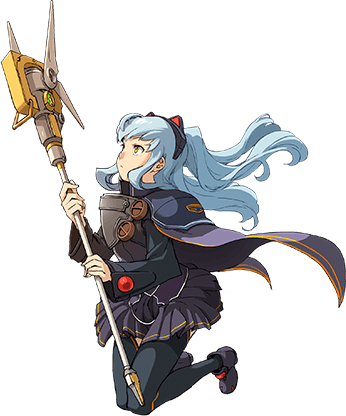



# Tio Plato is the Best

This is a small webpage/slideshow dedicated to my favorite character Tio Plato. It features over 100+ images that contain Tio as well as 30+ music tracks from Zero/Azure/Hajimari (and 1 from CSIV), which can be played by clicking the little Tio sitting on the bottom right of the screen. Image and music order is randomized every time you visit, so it is different each time. Feel free to use it as a screen saver or to listen to some of the best tracks from Zero, Azure, and Hajimari.

You can use it online or offline via the following links.

- **Online:** https://sethclydesdale.github.io/tio-plato-is-the-best/
- **Offline:** [Download](https://github.com/SethClydesdale/tio-plato-is-the-best/archive/main.zip)

If using offline, simply extract the folder, open the index.html file in the browser of your choice, and enjoy Tio! As a bonus, you can set the folder icon (or shortcut if you made one) to Tio using **tio-lg.ico** located under **aeon-system > images**.

Enjoy☆Tio~!!

## Who is Tio Plato?

Tio Plato is a character from [Falcom's](https://www.falcom.co.jp/) [The Legend of Heroes: Trails series](https://www.thelegendofheroes.com/) ([<ruby>英雄伝説<rt>えいゆうでんせつ</rt></ruby> <ruby>軌跡<rt>きせき</rt></ruby>シリーズ](https://www.falcom.co.jp/kiseki/)) and is my most favorite character, EVER, if you haven't already noticed. She's smart, strong, cute, and above all else, is super passionate about her favorite mascot character, Mishy. She makes her first appearance in [Trails from Zero](https://www.thelegendofheroes.com/crossbell/) ([<ruby>零<rt>ゼロ</rt></ruby>の<ruby>軌跡<rt>きせき</rt></ruby>](https://www.falcom.co.jp/zeroao/)) and grows tremendously throughout the series as she struggles to find her place in the world and reclaim her lost emotions. Her tale is extremely touching... so I highly recommend playing Zero and Azure to experience her story and exceptional character development!

## Credits
Music, Illustrations, etc. Copyright (c) [Nihon Falcom Corporation](https://www.falcom.co.jp/)

## Special Thanks

- **Falcom** for Tio Plato and of course, all the amazing music and games.

- **Tio Plato** for being the best and playing us music <3

- **Mishy** for bringing Tio happiness and visitors to this repo.

- [**waifu2x**](https://github.com/nagadomi/waifu2x) for upscaling Tio, so that we can enjoy her cuteness at higher resolutions.

  
  

